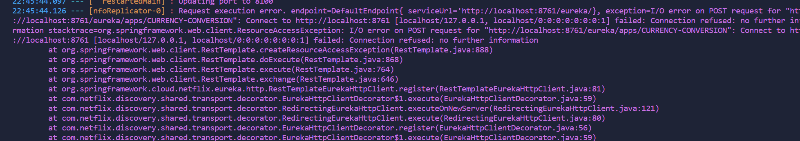

### You need to run first the EUREKA discovery server or you will get this error



### Currency Conversion Service
```properties
spring.application.name=currency-conversion
server.port=8100

eureka.client.serviceUrl.defaultZone=http://localhost:8761/eureka

management.tracing.sampling.probability=1.0
logging.pattern.level=%5p [${spring.application.name:},%X{traceId:-},%X{spanId:-}]

spring.config.import=optional:configserver:
```