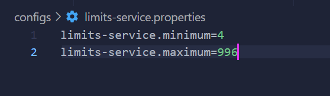
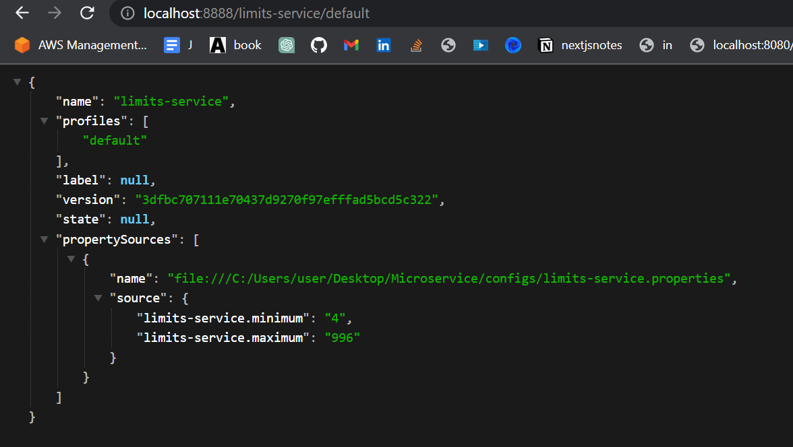

## OpenFeign

1. Add the `@EnableFeignClients` on `@Configuration` annotated classes
```java
@SpringBootApplication
@EnableFeignClients
public class Application {
    public static void main(String[] args) {
        SpringApplication.run(Application.class, args);
    }
}
```

2. Create a Proxy
```java
@FeignClient("stores")
public interface StoreClient {
    @RequestMapping(method = RequestMethod.GET, value = "/stores")
    List<Store> getStores();

    @RequestMapping(method = RequestMethod.GET, value = "/stores")
    Page<Store> getStores(Pageable pageable);

    @RequestMapping(method = RequestMethod.POST, value = "/stores/{storeId}", consumes = "application/json")
    Store update(@PathVariable("storeId") Long storeId, Store store);

    @RequestMapping(method = RequestMethod.DELETE, value = "/stores/{storeId:\\d+}")
    void delete(@PathVariable Long storeId);
}
```
- here the `stores` or `name = stores` has a registered url in the use Discovery Server like Eureka
- You can also specify a URL using the url attribute (absolute value or just a hostname).
  - ```java
    @FeignClient(name = "stores", url="http://sample.com")
    ```
- The load-balancer client above will want to discover the physical addresses for the "stores" service. If your application is a Eureka client then it will resolve the service in the Eureka service registry. If you don’t want to use Eureka, you can configure a list of servers in your external configuration using SimpleDiscoveryClient.


### Cloud Config Server
1. Create the folder where you will store your configs
2. Create the properties file
   
3. initialize git (`git init`), add all and commit
4. Create the Config Server
5. Annotate the application with `@EnableConfigServer`
6. Add the properties, uri must be `file://{PROPERTIES_DIRECTORY}`
   - ```properties
     spring.application.name=spring-cloud-config-server
     server.port=8888
     spring.cloud.config.server.git.uri=file:///C:/Users/user/Desktop/Microservice/configs
     ```
7. Test if it is working. Endpoints - `http://localhost:{PORT}/{PROPERTY_FILE_NAME}/{ACTIVE_PROFILE}`, default active profile is = `default`
   - `http://localhost:8888/limits-service/default`
     - 
